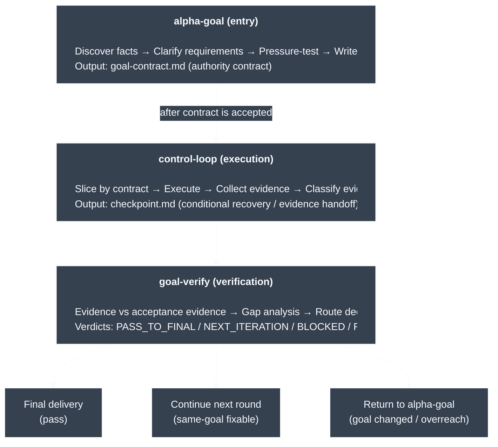

# Alpha Goal

Languages: [Chinese](README.md) | English

Alpha Goal is a minimal persistent closed-loop skillset for goal engineering work. It guides agents to discover facts before asking, resume goal framing from a draft or accepted `goal-contract.md`, pass user confirmation gates before handing an accepted Goal Contract to execution, and make final claims only as far as evidence supports them.

## What Problem It Solves

Alpha Goal gives AI agents a Goal Engineering control loop for three common failure modes:

<table>
  <thead>
    <tr>
      <th width="100" style="text-align:left;">Problem</th>
      <th style="text-align:left;">What it looks like</th>
      <th style="text-align:left;">Control point</th>
    </tr>
  </thead>
  <tbody>
    <tr>
      <td width="140"><strong>Goal drift</strong></td>
      <td>The agent starts before requirements are clear, gradually moves off target, and changes unrelated things along the way.</td>
      <td><code>alpha-goal</code> discovers facts, clarifies the goal, boundaries, non-goals, and acceptance evidence, then writes a user-confirmed <code>goal-contract.md</code>.</td>
    </tr>
    <tr>
      <td width="140"><strong>Action overreach</strong></td>
      <td>There is no explicit authority boundary, so work can exceed scope, touch the wrong branch, or treat current implementation as desired behavior.</td>
      <td><code>control-loop</code> executes only bounded slices inside an accepted contract, with worktree/branch, scope, non-goals, and claim-boundary checks before mutation.</td>
    </tr>
    <tr>
      <td width="140"><strong>Evidence-free completion</strong></td>
      <td>A passing test or partial success is treated as proof that the goal is complete.</td>
      <td><code>goal-verify</code> compares evidence against acceptance evidence, classifies gaps, and returns a route decision.</td>
    </tr>
  </tbody>
</table>

In practice, it compresses requirement clarification, authority boundaries, iterative execution, evidence verification, and delivery claims into a minimal persistent loop that an agent can understand, execute, and recover.

## Core Architecture



```text
Trigger -> Preflight/Discovery -> Clarify -> Write Contract -> Technical Design? -> Review -> Confirm
Accepted Goal Contract -> $control-loop -> Act -> Evidence -> $goal-verify -> Gap? -> Harden or Final Claim
```

## Quick start

```bash
scripts/install.sh
npx --no-install tsx tools/validate_skills.ts .
```

The installer creates direct symlinks for the three public skills under `$HOME/.codex/skills/` and cleans same-repo links for merged old public skills.
The validator checks that the whole `skills/` tree stays under 15,000 word+punctuation units, counted as words plus punctuation/symbol marks. This budget preserves the Persistent Goal Loop contracts for trigger behavior, durable state, memory, authority gates, behavior-level gates, and evaluator feedback without over-compressing skill text.

## Usage examples

```text
$alpha-goal Decide whether this task should discover facts, clarify, write a contract, add a technical design, confirm, or hand off to execution/verification.
$control-loop Execute or harden the next most useful verifiable bounded slice from an accepted Goal Contract.
```

You usually do not need to name a skill. Describe the work normally; Alpha Goal is meant to activate when the request needs goal framing, bounded execution, or evidence-backed completion.

## Public skills

<table>
  <thead>
    <tr>
      <th width="150" style="text-align:left;">Skill</th>
      <th style="text-align:left;">What it helps with</th>
    </tr>
  </thead>
  <tbody>
    <tr>
      <td width="180" style="text-align:left;"><a href="skills/alpha-goal/"><code>alpha-goal</code></a></td>
      <td style="text-align:left;">Clarify intent, boundaries, and acceptance evidence, produce a Goal Contract for confirmation, and add a Technical Design when cross-file predictive changes need one.</td>
    </tr>
    <tr>
      <td width="180" style="text-align:left;"><a href="skills/control-loop/"><code>control-loop</code></a></td>
      <td style="text-align:left;">Execute or harden an authorized slice, with <code>goal-contract.md</code> required and <code>checkpoint.md</code> used only as a conditional checkpoint.</td>
    </tr>
    <tr>
      <td width="180" style="text-align:left;"><a href="skills/goal-verify/"><code>goal-verify</code></a></td>
      <td style="text-align:left;">Verify goal completion, claim boundary, evidence coverage, and material unclaimed defects/risks, then return the next Gap.</td>
    </tr>
  </tbody>
</table>

## Principles

Alpha Goal keeps agent work explicit, bounded, and accountable to evidence.

- Evidence before authority: Current code facts describe current state; desired behavior comes from user intent, specs, issues, or accepted contracts.
- Goals before action: expected outcome, scope, non-goals, acceptance evidence, decision owner, and claim boundary define what may change.
- Persistent state: `goal-contract.md` is the default `alpha-goal` output and contains discovery notes, interview ledger, and the final contract; `checkpoint.md` conditionally carries the run profile.
- Bounded execution: prefer bounded evidence-producing actions or targeted changes over broad refactors and speculative cleanup; the accepted contract, required Run Profile, and repo policy constrain action authority.
- Independent verification: final/ready/safe/complete/repair/review claims require fresh evidence and defect/risk scanning, checked separately from execution.
- Honest routing: unclear goals return to `alpha-goal`, same-goal fixable execution gaps return to `control-loop`, and unsupported or under-reviewed final claims continue through `goal-verify`.
