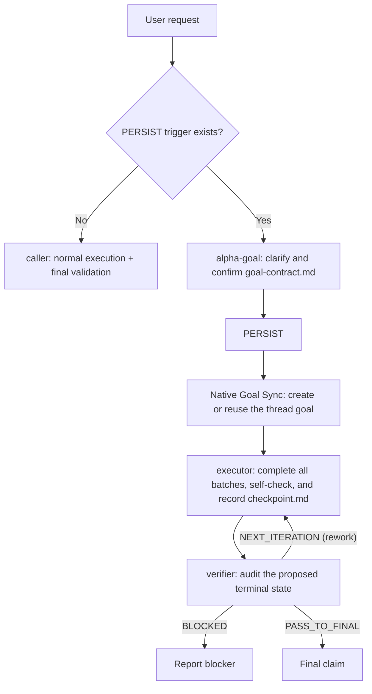

# Alpha Goal

Languages: [Chinese](README.md) | English

Alpha Goal is a minimal persistent closed-loop skillset for goal engineering work. It guides agents to discover facts before asking, operate within accepted authority boundaries, resume execution from an accepted Goal Contract and the necessary checkpoint state, and make final claims only as far as evidence supports them.

## What Problem It Solves

Alpha Goal gives AI agents a Goal Engineering control loop for three common failure modes:

<table>
  <thead>
    <tr>
      <th width="260" align="left">Problem</th>
      <th align="left">What it looks like</th>
      <th align="left">Control point</th>
    </tr>
  </thead>
  <tbody>
    <tr>
      <td width="260" align="left"><strong>Goal&nbsp;drift</strong></td>
      <td align="left">The agent starts before requirements are clear, gradually moves off target, and changes unrelated things along the way.</td>
      <td align="left"><code>alpha-goal</code> discovers facts, clarifies the goal, boundaries, non-goals, and acceptance evidence, then writes a user-confirmed <code>goal-contract.md</code>.</td>
    </tr>
    <tr>
      <td width="260" align="left"><strong>Action&nbsp;overreach</strong></td>
      <td align="left">There is no explicit authority boundary, so work can exceed scope, touch the wrong branch, or treat current implementation as desired behavior.</td>
      <td align="left"><code>executor</code> completes all authorized batches inside an accepted contract, with worktree/branch, scope, non-goals, and claim-boundary checks before mutation.</td>
    </tr>
    <tr>
      <td width="260" align="left"><strong>Evidence&#8209;free&nbsp;completion</strong></td>
      <td align="left">A passing test or partial success is treated as proof that the goal is complete.</td>
      <td align="left"><code>verifier</code> audits only the terminal state proposed by executor and returns a final route decision against acceptance evidence.</td>
    </tr>
  </tbody>
</table>

In practice, it compresses requirement clarification, authority boundaries, iterative execution, evidence verification, and delivery claims into a minimal persistent loop that an agent can understand, execute, and recover.

## Core Architecture



```text
Ordinary direct work -> caller execution and validation without alpha-goal
PERSIST trigger -> Frame Goal -> Confirm accepted Goal Contract -> Native Goal Sync -> $executor -> Proposed Terminal State -> $verifier -> Rework or Final Claim
Accepted goal materially changes -> terminate the old checkpoint -> start a new alpha-goal task directory
```

A Goal Frame contains intent, observable outcome, scope/non-goals, constraints, success signals, observers, and material decisions. Clear fields come from the request and attributable facts; clarification asks the relevant authority about one highest-impact blocking gap and closes it only when the authorized decision and its material boundaries and execution/evidence consequences are determined. A material change to an accepted goal terminates the old task; the new goal starts `alpha-goal` in a new task directory instead of reopening the old contract or checkpoint.

Ordinary direct work does not activate `alpha-goal`; the caller executes and validates it without Alpha Goal state, a native goal, `executor`, or `verifier`. An explicit `$alpha-goal` invocation with no persistence trigger returns to the caller without an entry route. After a `PERSIST` contract is explicitly accepted, Alpha Goal reuses any unfinished native goal in the current thread; it creates one only when none is unfinished. Native state is lifecycle metadata and never replaces contract authority or acceptance evidence. The only canonical `PERSIST` lifecycle artifacts remain `goal-contract.md` and `checkpoint.md`.

The complete `PERSIST` execution and final-audit loop requires both `executor` and `verifier`; install only `alpha-goal` when that loop is not needed.

- `goal-contract.md`: written only by `alpha-goal`; its accepted authority payload is standard structured input to executor and verifier.
- `checkpoint.md`: records the current contract digest and execution/terminal-audit state. Executor and verifier hand off sequentially through `checkpoint_revision` and `active_owner`; each writer re-reads current state and stops on conflict.

Routing uses material impact, side effects, recovery needs, and verifiability. Confidence, file count, step count, question count, and estimated duration are not risk proxies.

## Quick start

```bash
bash ./scripts/install.sh
node tools/validate_skills.js .
node tools/validate_skills.js --fixtures
```

The installer always copies `alpha-goal` and lets the user choose whether to install `executor` and `verifier` as a pair; choosing No preserves existing copies. See [INSTALL.md](INSTALL.md) for full behavior and smoke testing.

## Usage examples

```text
$alpha-goal Implement this requirement: <YOUR-PRD> or <YOUR-DESCRIPTION>, <YOUR-UX> or <YOUR-DESIGN>.
```

You usually do not need to name a skill. Alpha Goal activates implicitly only for material authority decisions, external/destructive/cross-repository or disclosure/session effects, recovery across pauses/compaction/handoffs, or explicit audit requirements. Ordinary direct work does not activate it.

## Public skills

<table>
  <thead>
    <tr>
      <th width="150" align="left">Skill</th>
      <th align="left">What it helps with</th>
    </tr>
  </thead>
  <tbody>
    <tr>
      <td width="180" align="left"><a href="skills/alpha-goal/"><code>alpha-goal</code></a></td>
      <td align="left">Clarify intent, boundaries, and acceptance evidence only for work that requires persistent authority, recovery, or audit closure, then produce a Goal Contract.</td>
    </tr>
    <tr>
      <td width="180" align="left"><a href="skills/executor/"><code>executor</code></a></td>
      <td align="left">Execute authorized batches inside an accepted contract; <code>goal-contract.md</code> is authoritative and <code>checkpoint.md</code> records mutations, raw execution evidence, and handoff state.</td>
    </tr>
    <tr>
      <td width="180" align="left"><a href="skills/verifier/"><code>verifier</code></a></td>
      <td align="left">Audit fresh evidence for the proposed terminal state, update criterion status, and return <code>PASS_TO_FINAL</code>, <code>NEXT_ITERATION</code>, or <code>BLOCKED</code>.</td>
    </tr>
  </tbody>
</table>

## Principles

Alpha Goal keeps agent work explicit, bounded, and accountable to evidence.

- Discover facts before handling material decisions owned by the user or another authority; current code cannot define desired behavior by itself.
- Known infeasibility, an unavailable required observer, an unidentified claim surface, or an unmet prerequisite keeps the Goal Contract `draft`; `BLOCKED` only means an accepted premise was invalidated later by new facts.
- Direct work creates no persistent protocol; persistent work uses the minimum artifacts needed for authority, recovery, and audit.
- Executor owns all intermediate batches, risk boundaries, and proportionate checks; invoke verifier only for proposed completion or a terminal blocker decision.
- PASS binds to the target and delivery state actually observed and terminates that checkpoint; later work starts a new task.
- Volatile evidence records observation time and invalidation conditions; unidentified mutable surfaces cannot support an exact-binding claim.
- The Goal Contract is standard structured input to executor/verifier; `alpha-goal` reuses or creates the native goal before accepted `PERSIST` handoff.
- `tools/evals/runtime-boundaries.json` preserves 36 lifecycle and routing boundary expectations; `tools/evals/trigger-boundaries.json` preserves 12 activation/skip expectations. Schema validation is not evidence of actual model triggering.
