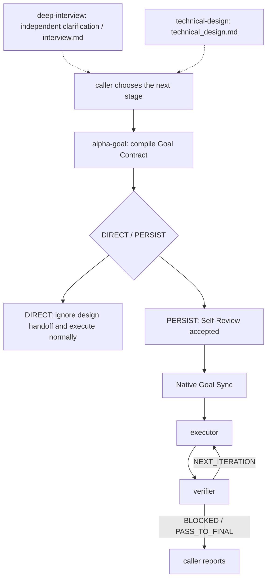

# Alpha Goal

Languages: [Chinese](README.md) | English

Alpha Goal is a modular minimal persistent closed-loop skillset for goal engineering work. It guides agents to discover facts before asking, operate within accepted authority boundaries, resume execution from an accepted Goal Contract and the necessary checkpoint state, and make final claims only as far as evidence supports them.

## What Problem It Solves

Alpha Goal gives AI agents a Goal Engineering control loop for three common failure modes:

<table>
  <thead>
    <tr>
      <th width="260" align="left">Problem</th>
      <th align="left">What it looks like</th>
      <th align="left">Control point</th>
    </tr>
  </thead>
  <tbody>
    <tr>
      <td width="260" align="left"><strong>Goal&nbsp;drift</strong></td>
      <td align="left">The agent starts before requirements are clear, gradually moves off target, and changes unrelated things along the way.</td>
      <td align="left"><code>alpha-goal</code> compiles <code>goal-contract.md</code> from the raw request, attributable inputs, and discovered facts, and accepts it only after Readiness and Self-Review pass.</td>
    </tr>
    <tr>
      <td width="260" align="left"><strong>Action&nbsp;overreach</strong></td>
      <td align="left">There is no explicit authority boundary, so work can exceed scope, touch the wrong branch, or treat current implementation as desired behavior.</td>
      <td align="left"><code>executor</code> completes all authorized batches inside an accepted contract, with worktree/branch, scope, non-goals, and claim-boundary checks before mutation.</td>
    </tr>
    <tr>
      <td width="260" align="left"><strong>Evidence&#8209;free&nbsp;completion</strong></td>
      <td align="left">A passing test or partial success is treated as proof that the goal is complete.</td>
      <td align="left"><code>verifier</code> audits only the terminal state proposed by executor and returns a final route decision against acceptance evidence.</td>
    </tr>
  </tbody>
</table>

In practice, it compresses requirement clarification, authority boundaries, iterative execution, evidence verification, and delivery claims into a minimal persistent loop that an agent can understand, execute, and recover.

## Core Architecture



`deep-interview` is an independent, source-neutral clarification stage. It may maintain canonical `interview.md` with append-only turns, provenance, and unresolved gaps, but it does not choose an execution route. `technical-design` is an independent pre-goal design stage. It writes canonical `technical_design.md`, returns `DESIGN_READY` after review, or returns `DESIGN_INPUT_GAP` / `DESIGN_BLOCKED`; recovery requires the exact path preserved in current context.

`alpha-goal` compiles directly from the raw request, attributable inputs, and discovered facts. Consuming any `DESIGN_READY` proposal forces `PERSIST`; `DIRECT` must ignore the design completely. A design path is provenance only. A constraint affects execution or acceptance only after it is written explicitly into the Goal Contract. `alpha-goal` sets the contract to `accepted` only after Readiness and Self-Review pass; there is no separate contract-confirmation ceremony.

`executor` and `verifier` accept only an accepted Goal Contract with `issued_by: alpha-goal`. They may read a design as explanatory context only after path, ready status, and workspace match, and must not expand scope, acceptance criteria, or checklists from it. `checkpoint.md` retains the sequential single-writer protocol.

## Quick start

```bash
bash ./scripts/install.sh
node tools/validate_skills.js .
node tools/validate_skills.js --fixtures
```

The installer always copies `deep-interview`, `alpha-goal`, and `technical-design`, and lets the user choose whether to install `executor` and `verifier` as a pair. Codex/all runs independently offer the global Custom Agents declared by the shared contract (default Yes); choosing No preserves existing copies. See [INSTALL.md](INSTALL.md) for full behavior and smoke testing.

## Usage examples

```text
$alpha-goal Implement this requirement: <YOUR-PRD> or <YOUR-DESCRIPTION>, <YOUR-UX> or <YOUR-DESIGN>.
```

You usually do not need to name a skill. Describe the work normally; Alpha Goal activates implicitly.

## Public skills

<table>
  <thead>
    <tr>
      <th width="150" align="left">Skill</th>
      <th align="left">What it helps with</th>
    </tr>
  </thead>
  <tbody>
    <tr>
      <td width="180" align="left"><a href="skills/deep-interview/"><code>deep-interview</code></a></td>
      <td align="left">Independently clarify ambiguous or high-impact requests and maintain append-only <code>interview.md</code> when durable provenance is needed, without choosing a route or granting execution authority.</td>
    </tr>
    <tr>
      <td width="180" align="left"><a href="skills/alpha-goal/"><code>alpha-goal</code></a></td>
      <td align="left">Choose DIRECT/PERSIST from raw and attributable input, compile and self-review the Goal Contract, then generate and synchronize the native goal objective.</td>
    </tr>
    <tr>
      <td width="180" align="left"><a href="skills/technical-design/"><code>technical-design</code></a></td>
      <td align="left">Maintain canonical <code>technical_design.md</code>, run technical review, and return DESIGN_READY / DESIGN_INPUT_GAP / DESIGN_BLOCKED without creating a Goal Contract.</td>
    </tr>
    <tr>
      <td width="180" align="left"><a href="skills/executor/"><code>executor</code></a></td>
      <td align="left">Execute authorized batches inside an accepted contract; <code>goal-contract.md</code> is authoritative and <code>checkpoint.md</code> records mutations, raw execution evidence, and handoff state.</td>
    </tr>
    <tr>
      <td width="180" align="left"><a href="skills/verifier/"><code>verifier</code></a></td>
      <td align="left">Audit fresh evidence for the proposed terminal state, update criterion status, and return <code>PASS_TO_FINAL</code>, <code>NEXT_ITERATION</code>, <code>BLOCKED</code>.</td>
    </tr>
  </tbody>
</table>

## Principles

Alpha Goal keeps agent work explicit, bounded, and accountable to evidence.

- Discover facts before handling material decisions owned by the user or another authority; current code cannot define desired behavior by itself.
- Known infeasibility, an unavailable required observer, an unidentified claim surface, or an unmet prerequisite keeps the Goal Contract `draft`; `BLOCKED` only means an accepted premise was invalidated later by new facts.
- Direct work creates no persistent protocol; persistent work uses the minimum artifacts needed for authority, recovery, and audit.
- Executor owns all intermediate batches, risk boundaries, and proportionate checks; invoke verifier only for proposed completion or a terminal blocker decision.
- PASS binds to the target and delivery state actually observed and terminates that checkpoint; later work starts a new task.
- Volatile evidence records observation time and invalidation conditions; unidentified mutable surfaces cannot support an exact-binding claim.
- The Goal Contract is standard structured input to executor/verifier; `alpha-goal` reuses or creates the native goal before accepted `PERSIST` handoff.
- `tools/evals/runtime-boundaries.json` preserves 42 static expected-boundary cases; schema validation is not runtime evidence.
