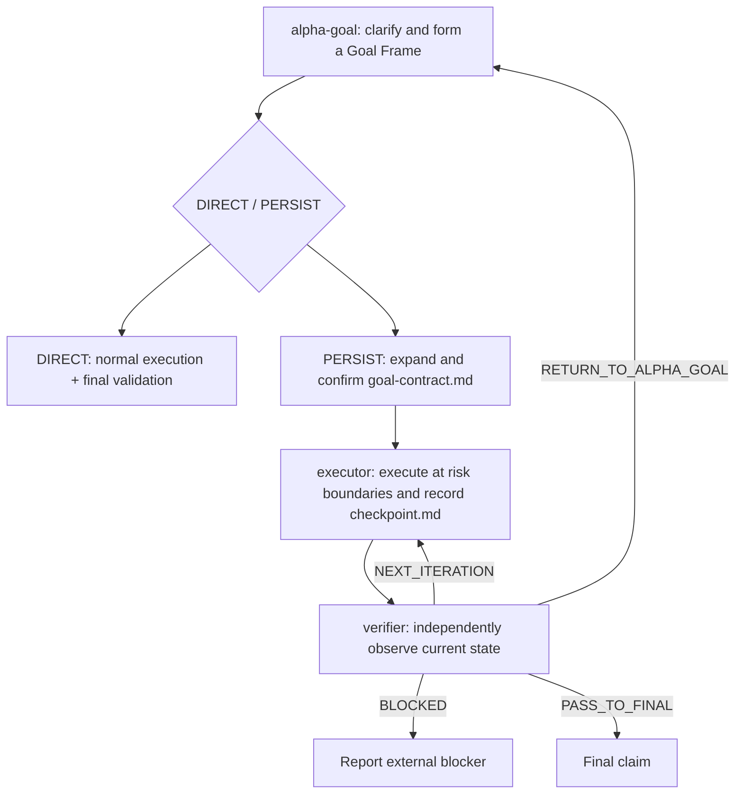

# Alpha Goal

Languages: [Chinese](README.md) | English

Alpha Goal clarifies and structures user intent into an executable, verifiable goal, then routes by materiality. Every change task first gets a minimal Goal Frame; work needing confirmation, recovery, or auditable evidence expands it into a Goal Contract.

## Core architecture



A Goal Frame contains intent, observable outcome, scope/non-goals, constraints, success signals, observers, and material decisions. Clear fields come directly from the request and attributable facts; only gaps that change execution or acceptance are asked.

`DIRECT` keeps the complete Goal Frame in current context, creates no Alpha Goal state, and does not call `executor` or `verifier`. `PERSIST` keeps two runtime artifacts:

- `goal-contract.md`: written only by `alpha-goal`; its accepted revision is standard structured input to executor, verifier, and an optional native Goal projection.
- `checkpoint.md`: retains immutable contract epochs, binds the current digest and state, and serializes executor/verifier handoff with an atomic lock plus revision/owner control.

Routing uses material impact, side effects, recovery needs, and verifiability. Confidence, file count, step count, question count, and estimated duration are not risk proxies.

## Public skills

| Skill | Single responsibility |
| --- | --- |
| [`alpha-goal`](skills/alpha-goal/) | Clarify and structure the goal, form a Goal Frame, choose `DIRECT / PERSIST`, and confirm a Goal Contract for persistent work. |
| [`executor`](skills/executor/) | Execute only an accepted persistent contract; maintain target/delivery mutations, raw execution evidence, and recovery records. |
| [`verifier`](skills/verifier/) | At a risk boundary or final state, independently collect verification observations, update criterion status, and return a route. |

## Quick start

```bash
bash ./scripts/install.sh
node tools/validate_skills.js .
node tools/validate_skills.js --fixtures
```

The installer copies the three public skills into independent runtime-specific roots and synchronizes the selected user templates. See [INSTALL.md](INSTALL.md) for full behavior and smoke testing.

Skills normally trigger from the task description. To invoke them explicitly:

```text
$alpha-goal Form a Goal Frame from the request and discovered facts, then choose DIRECT or PERSIST.
$executor Resume the accepted Goal Contract and execute the next authorized batch.
$verifier Verify the current persistent checkpoint at a risk boundary or final state.
```

## Principles

- Discover facts before asking for material authority-owned decisions; current code cannot define desired behavior by itself.
- Direct work creates no persistent protocol; persistent work uses the minimum artifacts needed for authority, recovery, and audit.
- Batch work inside one low-risk boundary; invoke verifier only at material risk boundaries and final state.
- PASS binds to the target and delivery state actually observed; a later mutation invalidates it.
- Volatile evidence records observation time and invalidation conditions; unidentified mutable surfaces cannot support an exact-binding claim.
- The Goal Contract is standard structured input; a native Goal is only a capability-conditional lifecycle projection bound to its path/revision/digest.
- `tools/evals/runtime-boundaries.json` preserves 28 static expected-boundary cases; schema validation is not runtime evidence.
