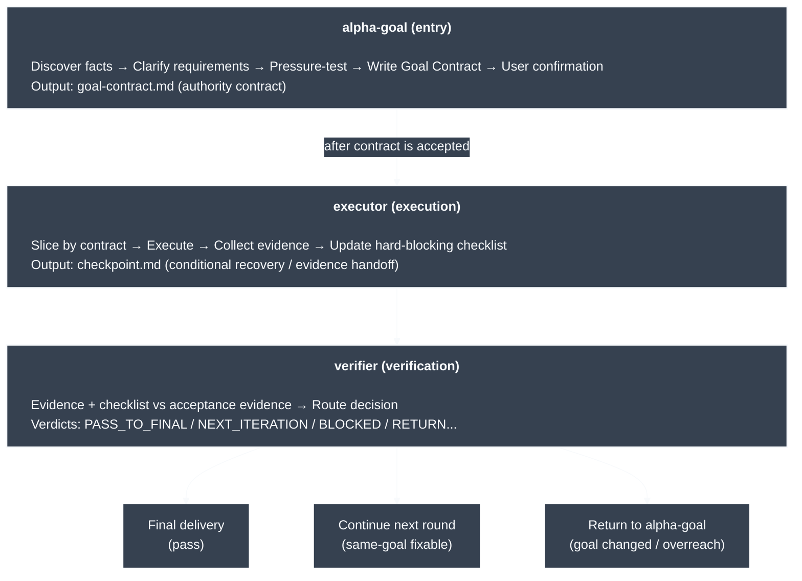

# Alpha Goal

Languages: [Chinese](README.md) | English

Alpha Goal is a minimal persistent closed-loop skillset for goal engineering work. It guides agents to discover facts before asking, resume goal framing from a draft or accepted `goal-contract.md`, pass user confirmation gates before handing an accepted Goal Contract to execution, and make final claims only as far as evidence supports them.

## What Problem It Solves

Alpha Goal gives AI agents a Goal Engineering control loop for three common failure modes:

<table>
  <thead>
    <tr>
      <th width="260" align="left">Problem</th>
      <th align="left">What it looks like</th>
      <th align="left">Control point</th>
    </tr>
  </thead>
  <tbody>
    <tr>
      <td width="260" align="left"><strong>Goal&nbsp;drift</strong></td>
      <td align="left">The agent starts before requirements are clear, gradually moves off target, and changes unrelated things along the way.</td>
      <td align="left"><code>alpha-goal</code> discovers facts, clarifies the goal, boundaries, non-goals, and acceptance evidence, then writes a user-confirmed <code>goal-contract.md</code>.</td>
    </tr>
    <tr>
      <td width="260" align="left"><strong>Action&nbsp;overreach</strong></td>
      <td align="left">There is no explicit authority boundary, so work can exceed scope, touch the wrong branch, or treat current implementation as desired behavior.</td>
      <td align="left"><code>executor</code> executes only bounded slices inside an accepted contract, with worktree/branch, scope, non-goals, and claim-boundary checks before mutation.</td>
    </tr>
    <tr>
      <td width="260" align="left"><strong>Evidence&#8209;free&nbsp;completion</strong></td>
      <td align="left">A passing test or partial success is treated as proof that the goal is complete.</td>
      <td align="left"><code>verifier</code> compares evidence against acceptance evidence and the hard-blocking checklist, then returns a route decision.</td>
    </tr>
  </tbody>
</table>

In practice, it compresses requirement clarification, authority boundaries, iterative execution, evidence verification, and delivery claims into a minimal persistent loop that an agent can understand, execute, and recover.

## Core Architecture



```text
Trigger -> Preflight/Discovery -> Clarify Goal Contract -> Review -> Confirm: launch / technical design / refine / reject
Technical design option -> Technical Design Runbook -> Technical Review -> Technical Confirm -> Native Goal Sync -> $executor
Accepted Goal Contract -> Native Goal Sync -> $executor -> Act -> Evidence + Checklist -> $verifier -> Route -> Next Slice or Final Claim
```

## Quick start

```bash
bash ./scripts/install.sh
node tools/validate_skills.js .
```

Requires Node.js 18+. The validator and installer TOML merge use repository-local JavaScript and vendored dependencies; `tsx` is not required.

The installer copies the three public skills into target-specific independent roots: `${CODEX_HOME:-$HOME/.codex}/skills` for `codex`, and `$HOME/.claude/skills` for `claude`. There is no `global` target. Without `--target`, interactive terminals use a color+Unicode arrow-key menu with `codex` highlighted by default, and non-interactive runs default to `codex`. Install and uninstall finish with a grouped summary that shows only active effects for the selected target and omits skipped lines; the install summary does not show `Result`, `Skills ... linked`, or `Install target`. Install migrates `skills/<skill>` symlinks from another worktree with the same Git common-dir into copied directories; external symlinks still require `--force` or are refused, same-name real directories are recopied, and ordinary files are refused. `--uninstall` removes managed configuration and managed skill copies only for the selected target. Uninstall does not follow configuration symlinks and does not remove external symlinks or mixed user configuration.

## Usage examples

```text
$alpha-goal Decide whether this task should discover facts, clarify, write a contract, add a technical design, confirm, or hand off to execution/verification.
$executor Execute or harden the next most useful verifiable bounded slice from an accepted Goal Contract.
```

You usually do not need to name a skill. Describe the work normally; Alpha Goal activates implicitly.

## Public skills

<table>
  <thead>
    <tr>
      <th width="150" align="left">Skill</th>
      <th align="left">What it helps with</th>
    </tr>
  </thead>
  <tbody>
    <tr>
      <td width="180" align="left"><a href="skills/alpha-goal/"><code>alpha-goal</code></a></td>
      <td align="left">Clarify intent, boundaries, and acceptance evidence, produce a Goal Contract for confirmation, and offer launch, technical design, refine, or reject as confirmation choices.</td>
    </tr>
    <tr>
      <td width="180" align="left"><a href="skills/executor/"><code>executor</code></a></td>
      <td align="left">Execute or harden an authorized slice, with <code>goal-contract.md</code> required and <code>checkpoint.md</code> used only as a conditional checkpoint.</td>
    </tr>
    <tr>
      <td width="180" align="left"><a href="skills/verifier/"><code>verifier</code></a></td>
      <td align="left">Verify goal completion, claim boundary, evidence coverage, blockers, and checklist coverage, then return the next route.</td>
    </tr>
  </tbody>
</table>

## Principles

Alpha Goal keeps agent work explicit, bounded, and accountable to evidence.

- Evidence before authority: Current code facts describe current state; desired behavior comes from user intent, specs, issues, or accepted contracts.
- Goals before action: expected outcome, scope, non-goals, acceptance evidence, decision owner, and claim boundary define what may change.
- Persistent state: `goal-contract.md` is the default `alpha-goal` output; `technical_design.md` is created only by `references/technical-design-runbook.md` after Goal Contract Confirmation Gate selects `run technical design`; `checkpoint.md` conditionally carries recovery and evidence handoff.
- Progressive disclosure: `alpha-goal` keeps only Goal Contract clarification, review, confirmation, and Native Goal Sync in `SKILL.md`; Technical Design clarification, review, and confirmation live in `references/technical-design-runbook.md`.
- Native Goal Sync: after the user accepts the contract, `alpha-goal` may create or reuse the current thread's native goal; execution and verification do not control native goal status.
- Bounded execution: prefer bounded evidence-producing actions or targeted changes over broad refactors and speculative cleanup.
- Independent verification: final/ready/safe/complete/repair/review claims require fresh evidence, hard-blocking checklist coverage, and blocker checks, reviewed separately from execution.
- Honest routing: unclear goals return to `alpha-goal`; same-goal fixable execution gaps return to `executor`.
