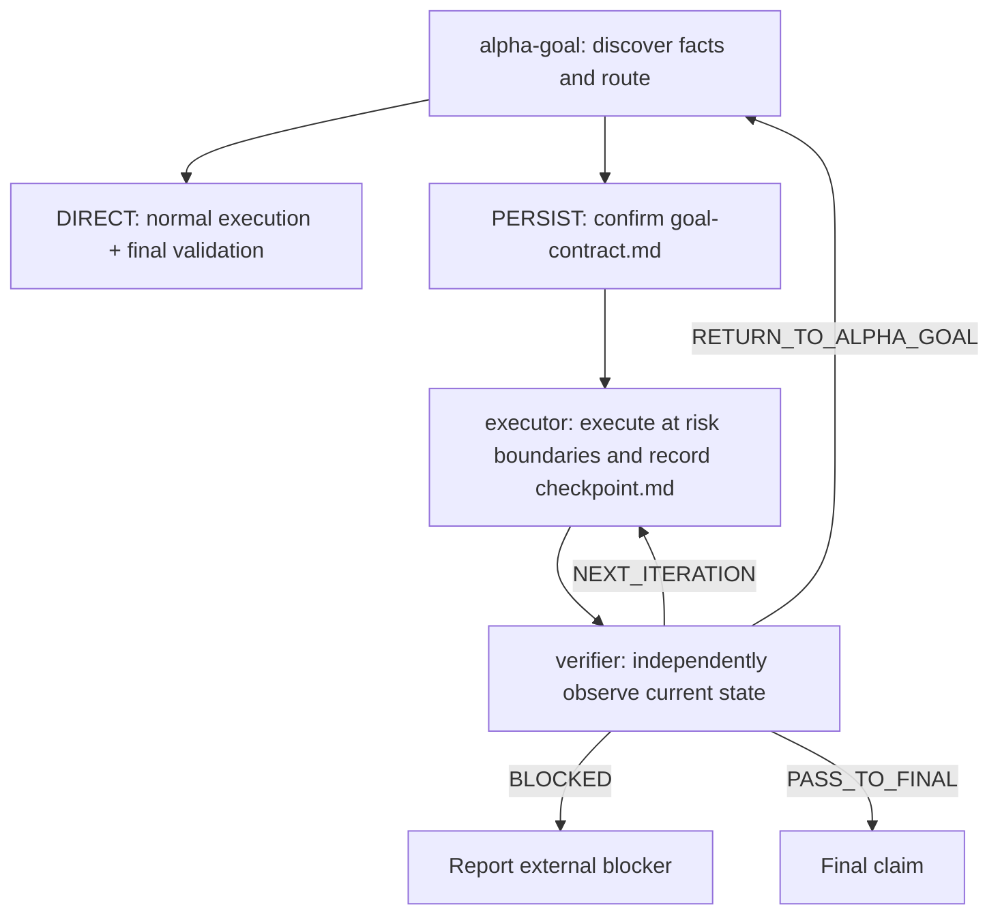

# Alpha Goal

Languages: [Chinese](README.md) | English

Alpha Goal is a materiality-routed Goal Engineering skillset. Clear, reversible, in-scope local work and pure read-only work execute directly; complex work enters a persistent loop only when it needs confirmation, recovery, or auditable evidence.

## Core architecture



`DIRECT` creates no Alpha Goal state and does not call `executor` or `verifier`. `PERSIST` keeps two runtime artifacts:

- `goal-contract.md`: written only by `alpha-goal`; records authority, boundaries, success criteria, and acceptance observers.
- `checkpoint.md`: `executor` writes execution and raw execution evidence; `verifier` writes verification observations, criterion status, and routes through sequential handoff.

Routing uses material impact, side effects, recovery needs, and verifiability. Confidence, file count, step count, question count, and estimated duration are not risk proxies.

## Public skills

| Skill | Single responsibility |
| --- | --- |
| [`alpha-goal`](skills/alpha-goal/) | Discover facts, choose `DIRECT / PERSIST`, and establish and confirm a Goal Contract only for persistent work. |
| [`executor`](skills/executor/) | Execute only an accepted persistent contract; maintain target/delivery mutations, raw execution evidence, and recovery records. |
| [`verifier`](skills/verifier/) | At a risk boundary or final state, independently collect verification observations, update criterion status, and return a route. |

## Quick start

```bash
bash ./scripts/install.sh
node tools/validate_skills.js .
node tools/validate_skills.js --fixtures
```

The installer copies the three public skills into independent runtime-specific roots and synchronizes the selected user templates. See [INSTALL.md](INSTALL.md) for full behavior and smoke testing.

Skills normally trigger from the task description. To invoke them explicitly:

```text
$alpha-goal Use discovered facts to route this task to DIRECT or PERSIST.
$executor Resume the accepted Goal Contract and execute the next authorized batch.
$verifier Verify the current persistent checkpoint at a risk boundary or final state.
```

## Principles

- Discover facts before asking for material authority-owned decisions; current code cannot define desired behavior by itself.
- Direct work creates no persistent protocol; persistent work uses the minimum artifacts needed for authority, recovery, and audit.
- Batch work inside one low-risk boundary; invoke verifier only at material risk boundaries and final state.
- PASS binds to the target and delivery state actually observed; a later mutation invalidates it.
- Native goals, structured input, and subagents are capability-conditional aids, not universal runtime prerequisites.
