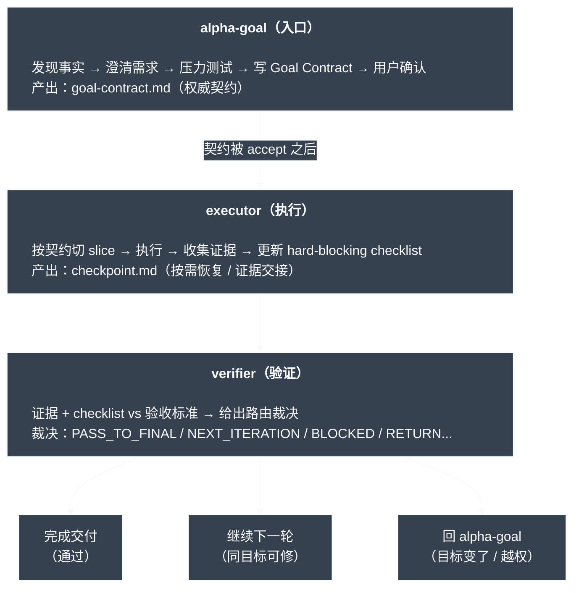

# Alpha Goal

语言：简体中文 | [English](README.en.md)

Alpha Goal 是用于 Goal Engineering 的最小持久闭环技能集。它要求智能体先发现事实再提问，基于已接受的 Goal Contract 和必要 checkpoint 恢复执行，在明确边界内行动，并且只在证据支持的范围内做最终声明。

## 解决什么问题

Alpha Goal 给 AI Agent 一套 Goal Engineering 控制闭环，重点约束三类常见失控：

<table>
  <thead>
    <tr>
      <th width="100" align="left">问题</th>
      <th align="left">具体表现</th>
      <th align="left">控制方式</th>
    </tr>
  </thead>
  <tbody>
    <tr>
      <td width="100" align="left"><strong>目标漂移</strong></td>
      <td align="left">需求没澄清就动手，做着做着方向偏了，顺手改一堆无关内容。</td>
      <td align="left"><code>alpha-goal</code> 先发现事实、澄清目标、边界、非目标和验收证据，再写出用户确认的 <code>goal-contract.md</code>。</td>
    </tr>
    <tr>
      <td width="100" align="left"><strong>行动越界</strong></td>
      <td align="left">没有授权边界，越过 scope、改错分支，或把当前实现当成期望行为。</td>
      <td align="left"><code>executor</code> 只执行已接受契约内的有界 slice，变更前检查 worktree/branch、scope、non-goals 和 claim boundary。</td>
    </tr>
    <tr>
      <td width="100" align="left"><strong>完成无据</strong></td>
      <td align="left">测试过了就说完成，或把局部成功当成目标达成。</td>
      <td align="left"><code>verifier</code> 对照 acceptance evidence 和 hard-blocking checklist 做证据验证，并返回路由裁决。</td>
    </tr>
  </tbody>
</table>

本质上，它把需求澄清、授权边界、迭代执行、证据验证和验收声明，压缩成 Agent 能理解、执行、恢复的最小持久闭环。

## 核心架构



```text
Trigger -> Preflight/Discovery -> Clarify Goal Contract -> Review -> Confirm: launch / technical design / refine / reject
Technical design option -> Technical Design Runbook -> Technical Review -> Technical Confirm -> Native Goal Sync -> $executor
Accepted Goal Contract -> Native Goal Sync -> $executor -> Act -> Evidence + Checklist -> $verifier -> Route -> Next Slice or Final Claim
```

## 快速开始

```bash
# 安装
bash ./scripts/install.sh

# 验证
node tools/validate_skills.js .
```

## 使用示例

```text
$alpha-goal 实现一下这个需求:<YOUR-PRD> or <YOUR-DESCRIPTION>，<YOUR-UX> or <YOUR-DESIGN> 。
```

通常不需要显式写出 skill 名称。正常描述你的需求即可；Alpha Goal 会隐式触发。

## 公开技能

<table>
  <thead>
    <tr>
      <th width="150" align="left">Skill</th>
      <th align="left">作用</th>
    </tr>
  </thead>
  <tbody>
    <tr>
      <td width="180" align="left"><a href="skills/alpha-goal/"><code>alpha-goal</code></a></td>
      <td align="left">在开始工作前聚焦澄清意图、边界、验收证据，产出待确认 Goal Contract；确认选项包含直接执行、进入技术设计、继续澄清或拒绝。</td>
    </tr>
    <tr>
      <td width="180" align="left"><a href="skills/executor/"><code>executor</code></a></td>
      <td align="left">执行或加固已授权 slice；<code>goal-contract.md</code> 是必需输入，<code>checkpoint.md</code> 仅作为条件检查点。</td>
    </tr>
    <tr>
      <td width="180" align="left"><a href="skills/verifier/"><code>verifier</code></a></td>
      <td align="left">验证目标完成、声明边界、证据覆盖、blocker 和 checklist 覆盖，并输出下一步 route。</td>
    </tr>
  </tbody>
</table>

## 设计原则

Alpha Goal 让 agent 工作保持目标明确、行动有界、声明受证据约束。

- 证据先于授权：当前代码事实只描述现状；期望行为来自用户意图、规格、issue 或已接受契约。
- 目标先于行动：预期结果、范围、非目标、验收证据、决策负责人和声明边界共同限定什么可以被改变。
- 持久状态：`goal-contract.md` 是 `alpha-goal` 的默认产物；`technical_design.md` 仅在 Goal Contract Confirmation Gate 选择 `run technical design` 后由 `references/technical-design-runbook.md` 创建；`checkpoint.md` 按需承载运行档案。
- 渐进披露：`alpha-goal` 主体只保留 Goal Contract 澄清、review、confirm 和 Native Goal Sync；Technical Design 的澄清、review 和 confirm 放在 `references/technical-design-runbook.md`。
- Native Goal Sync：用户确认契约后，`alpha-goal` 才能创建或复用当前线程的 native goal；后续执行和验证不控制原生 goal 状态。
- 有界执行：优先选择可取证的有界动作或定向变更，而非宽泛重构和猜测式清理。
- 独立验证：最终、就绪、安全、完成、修复或评审等声明需要新鲜证据、hard-blocking checklist 和 blocker 检查，并且要与执行过程分离检查。
- 诚实路由：目标不清回到 `alpha-goal`，同一目标内可修复的执行缺口回到 `executor`。
