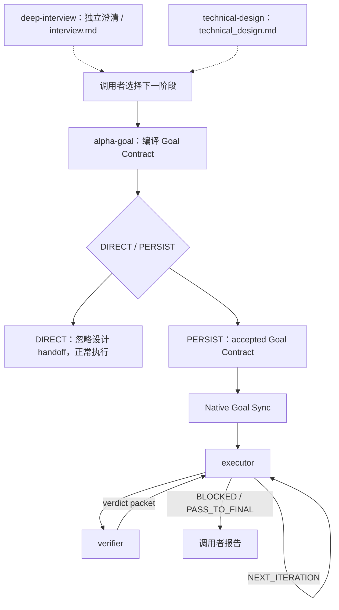

# Alpha Goal

语言：简体中文 | [English](README.en.md)

Alpha Goal 是用于 Goal Engineering 的模块化最小持久闭环技能集。它要求智能体先发现事实再提问，基于已接受的 Goal Contract 和必要 checkpoint 恢复执行，在明确边界内行动，并且只在证据支持的范围内做最终声明。

## 解决什么问题

Alpha Goal 给 AI Agent 一套 Goal Engineering 控制闭环，重点约束三类常见失控：

<table>
  <thead>
    <tr>
      <th width="100" align="left">问题</th>
      <th align="left">具体表现</th>
      <th align="left">控制方式</th>
    </tr>
  </thead>
  <tbody>
    <tr>
      <td width="100" align="left"><strong>目标漂移</strong></td>
      <td align="left">需求没澄清就动手，做着做着方向偏了，顺手改一堆无关内容。</td>
      <td align="left"><code>alpha-goal</code> 从原始请求、可归因输入和已发现事实编译 <code>goal-contract.md</code>，并仅在执行所需信息、授权和验证条件完整后设置为 `accepted`。</td>
    </tr>
    <tr>
      <td width="100" align="left"><strong>行动越界</strong></td>
      <td align="left">没有授权边界，越过 scope、改错分支，或把当前实现当成期望行为。</td>
      <td align="left"><code>executor</code> 持续完成已接受契约内的全部授权 batch，变更前检查 worktree/branch、scope、non-goals 和 claim boundary。</td>
    </tr>
    <tr>
      <td width="100" align="left"><strong>完成无据</strong></td>
      <td align="left">测试过了就说完成，或把局部成功当成目标达成。</td>
      <td align="left"><code>verifier</code> 只审核 executor 提交的终态，对照 acceptance evidence 返回最终路由裁决。</td>
    </tr>
  </tbody>
</table>

本质上，它把需求澄清、授权边界、迭代执行、证据验证和验收声明，压缩成 Agent 能理解、执行、恢复的最小持久闭环。

## 核心架构



`deep-interview` 通过 `allow_implicit_invocation: false` 设为仅显式调用，是独立、source-neutral 的澄清阶段：按需写入 canonical `interview.md`，保留 append-only 问答、来源和未决 gap，不选择执行路由。`technical-design` 同样通过 skill policy 设为仅显式调用，是独立的 pre-goal 设计阶段：写入 canonical `technical_design.md`，通过技术评审后返回 `DESIGN_READY`，或返回 `DESIGN_INPUT_GAP` / `DESIGN_BLOCKED`；恢复时必须使用当前上下文保存的精确路径。

`alpha-goal` 直接从原始请求、可归因输入和已发现事实编译目标。若消费 `DESIGN_READY` 的任何提案，必须走 `PERSIST`；`DIRECT` 必须完全忽略该设计。设计路径只表示 provenance，只有显式写入 Goal Contract 的约束才影响执行或验收。`alpha-goal` 仅在执行所需信息、授权、observer 和风险处理完整后将 Goal Contract 设置为 `accepted`，不增加单独的用户确认仪式或重复 gate 字段。

`executor` 与 `verifier` 只接受 `status: accepted` 的 canonical Goal Contract。它们可在路径、ready 状态和 workspace 匹配后读取设计作为解释性上下文，但不得从设计扩张 scope、acceptance criteria 或 checklist。`checkpoint.md` 记录执行阶段和证据；verifier 审计当前状态并返回 verdict。

## 快速开始

```bash
bash ./scripts/install.sh
node tools/validate_skills.js .
node tools/validate_skills.js --fixtures
```

安装器始终复制 `deep-interview`、`alpha-goal` 与 `technical-design`，并让用户选择是否成组安装 `executor` 与 `verifier`；Codex/all 还会独立询问是否安装共享契约声明的全局 Custom Agents（默认 Yes），选择 No 会保留已有副本。完整行为和 smoke 流程见 [INSTALL.md](INSTALL.md)。

## 使用示例

```text
$alpha-goal 实现一下这个需求:<YOUR-PRD> or <YOUR-DESCRIPTION>，<YOUR-UX> or <YOUR-DESIGN> 。
```

通常不需要显式写出 skill 名称。正常描述你的需求即可；Alpha Goal 会隐式触发。

## 公开技能

<table>
  <thead>
    <tr>
      <th width="150" align="left">Skill</th>
      <th align="left">作用</th>
    </tr>
  </thead>
  <tbody>
    <tr>
      <td width="180" align="left"><a href="skills/deep-interview/"><code>deep-interview</code></a></td>
      <td align="left">澄清请求并按需维护 append-only <code>interview.md</code>；不选择路由或授予执行权限。</td>
    </tr>
    <tr>
      <td width="180" align="left"><a href="skills/alpha-goal/"><code>alpha-goal</code></a></td>
      <td align="left">从原始请求和可归因输入选择 DIRECT/PERSIST，检查并接受 Goal Contract，再生成和同步 native goal objective。</td>
    </tr>
    <tr>
      <td width="180" align="left"><a href="skills/technical-design/"><code>technical-design</code></a></td>
      <td align="left">维护 canonical <code>technical_design.md</code>，完成技术评审并返回 DESIGN_READY / DESIGN_INPUT_GAP / DESIGN_BLOCKED；不创建 Goal Contract。</td>
    </tr>
    <tr>
      <td width="180" align="left"><a href="skills/executor/"><code>executor</code></a></td>
      <td align="left">执行已接受契约内的授权 batch；<code>goal-contract.md</code> 是权威输入，<code>checkpoint.md</code> 记录 mutation、原始执行证据与交接状态。</td>
    </tr>
    <tr>
      <td width="180" align="left"><a href="skills/verifier/"><code>verifier</code></a></td>
      <td align="left">审核拟议终态的 fresh evidence，返回 criterion 结果与 <code>PASS_TO_FINAL</code> / <code>NEXT_ITERATION</code> / <code>BLOCKED</code> verdict。</td>
    </tr>
  </tbody>
</table>

## 设计原则

Alpha Goal 让 agent 工作保持目标明确、行动有界、声明受证据约束。

- 先发现事实，再处理由用户或其他授权来源拥有的材料性决策；现有代码不能自行定义期望行为。
- 已知不可行、required observer 不可用、claim surface 未标识或 prerequisite 未满足时，Goal Contract 必须保持 `draft`；`BLOCKED` 只表示 accepted 前提在运行期被新事实推翻。
- 直达任务不制造持久协议；持久任务用最小 artifact 支持授权、恢复和审计。
- executor 负责全部中间 batch、风险边界和按比例自检；只有拟议完成态或需要终态 blocker 判定时才调用 verifier。
- PASS 绑定实际观察到的最终目标与交付状态并终止该 checkpoint；后续工作创建新任务。
- 时效性证据记录观察时间与失效条件；无法标识的可变表面不得声称精确绑定。
- Goal Contract 是 executor/verifier 的标准结构化输入；`alpha-goal` 在 accepted `PERSIST` 交接前复用或创建 native goal。
- `tools/evals/runtime-boundaries.json` 固化 42 个静态边界预期；结构校验通过不等于真实运行证据。
