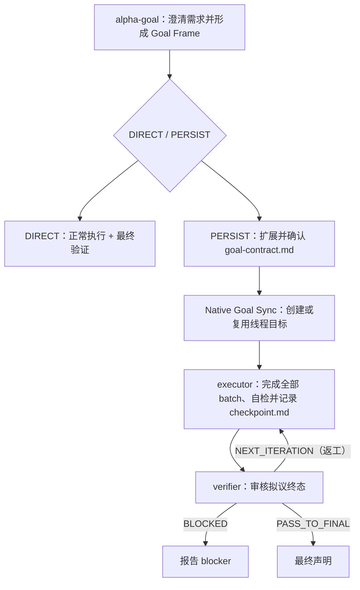

# Alpha Goal

语言：简体中文 | [English](README.en.md)

Alpha Goal 是用于 Goal Engineering 的最小持久闭环技能集。它要求智能体先发现事实再提问，基于已接受的 Goal Contract 和必要 checkpoint 恢复执行，在明确边界内行动，并且只在证据支持的范围内做最终声明。

## 解决什么问题

Alpha Goal 给 AI Agent 一套 Goal Engineering 控制闭环，重点约束三类常见失控：

<table>
  <thead>
    <tr>
      <th width="100" align="left">问题</th>
      <th align="left">具体表现</th>
      <th align="left">控制方式</th>
    </tr>
  </thead>
  <tbody>
    <tr>
      <td width="100" align="left"><strong>目标漂移</strong></td>
      <td align="left">需求没澄清就动手，做着做着方向偏了，顺手改一堆无关内容。</td>
      <td align="left"><code>alpha-goal</code> 先发现事实、澄清目标、边界、非目标和验收证据，再写出用户确认的 <code>goal-contract.md</code>。</td>
    </tr>
    <tr>
      <td width="100" align="left"><strong>行动越界</strong></td>
      <td align="left">没有授权边界，越过 scope、改错分支，或把当前实现当成期望行为。</td>
      <td align="left"><code>executor</code> 持续完成已接受契约内的全部授权 batch，变更前检查 worktree/branch、scope、non-goals 和 claim boundary。</td>
    </tr>
    <tr>
      <td width="100" align="left"><strong>完成无据</strong></td>
      <td align="left">测试过了就说完成，或把局部成功当成目标达成。</td>
      <td align="left"><code>verifier</code> 只审核 executor 提交的终态，对照 acceptance evidence 返回最终路由裁决。</td>
    </tr>
  </tbody>
</table>

本质上，它把需求澄清、授权边界、迭代执行、证据验证和验收声明，压缩成 Agent 能理解、执行、恢复的最小持久闭环。

## 核心架构



```text
Trigger -> Frame Goal -> Choose DIRECT/PERSIST
PERSIST -> Confirm accepted Goal Contract -> Native Goal Sync -> $executor -> Proposed Terminal State -> $verifier -> Rework or Final Claim
Accepted goal materially changes -> terminate the old checkpoint -> start a new alpha-goal task directory
```

Goal Frame 包含 intent、observable outcome、scope/non-goals、constraints、success signals、observers 和 material decisions；已清晰内容直接来自请求与可归因事实，只向相关 authority 追问最高影响的单个 blocking gap，并仅在授权决定及其 material boundaries、执行/证据后果可确定时闭合。accepted goal 发生材料性变化时，旧任务终止；新目标使用新的任务目录重新进入 `alpha-goal`，不重开旧 contract/checkpoint。

`DIRECT` 将完整 Goal Frame 保留在当前上下文，不创建 Alpha Goal 状态或 native goal，也不调用 `executor` 或 `verifier`。`PERSIST` 在契约被明确接受后复用当前线程中未完成的 native goal；没有未完成目标时才创建。native goal 只是 lifecycle metadata，不能替代契约 authority 或验收证据。`PERSIST` 的 canonical lifecycle artifacts 仍只有 `goal-contract.md` 与 `checkpoint.md`。

完整的 `PERSIST` 执行与终审闭环需要同时安装 `executor` 和 `verifier`；只安装 `alpha-goal` 适用于不需要该闭环的场景。

- `goal-contract.md`：由 `alpha-goal` 独占修改；accepted authority payload 是 executor 和 verifier 的标准结构化输入。
- `checkpoint.md`：记录当前契约 digest 与执行/终态审核状态；`executor`、`verifier` 通过 `checkpoint_revision` 和 `active_owner` 顺序交接，写前必须重读当前状态，冲突时停止并重新判断。

路由只看材料性影响、副作用、恢复需求和可验证性；不以置信度、文件数、步骤数、问答轮次或预计时长替代风险判断。

## 快速开始

```bash
bash ./scripts/install.sh
node tools/validate_skills.js .
node tools/validate_skills.js --fixtures
```

安装器始终复制 `alpha-goal`，并让用户选择是否成组安装 `executor` 与 `verifier`；Codex/all 还会独立询问是否安装共享契约声明的全局 Custom Agents（默认 Yes），选择 No 会保留已有副本。完整行为和 smoke 流程见 [INSTALL.md](INSTALL.md)。

## 使用示例

```text
$alpha-goal 实现一下这个需求:<YOUR-PRD> or <YOUR-DESCRIPTION>，<YOUR-UX> or <YOUR-DESIGN> 。
```

通常不需要显式写出 skill 名称。正常描述你的需求即可；Alpha Goal 会隐式触发。

## 公开技能

<table>
  <thead>
    <tr>
      <th width="150" align="left">Skill</th>
      <th align="left">作用</th>
    </tr>
  </thead>
  <tbody>
    <tr>
      <td width="180" align="left"><a href="skills/alpha-goal/"><code>alpha-goal</code></a></td>
      <td align="left">在开始工作前聚焦澄清意图、边界、验收证据，形成 Goal Frame，并在需要持久闭环时产出待确认 Goal Contract。</td>
    </tr>
    <tr>
      <td width="180" align="left"><a href="skills/executor/"><code>executor</code></a></td>
      <td align="left">执行已接受契约内的授权 batch；<code>goal-contract.md</code> 是权威输入，<code>checkpoint.md</code> 记录 mutation、原始执行证据与交接状态。</td>
    </tr>
    <tr>
      <td width="180" align="left"><a href="skills/verifier/"><code>verifier</code></a></td>
      <td align="left">只审核拟议终态的 fresh evidence，更新 criterion 状态，并输出 <code>PASS_TO_FINAL</code> / <code>NEXT_ITERATION</code> / <code>BLOCKED</code>。</td>
    </tr>
  </tbody>
</table>

## 设计原则

Alpha Goal 让 agent 工作保持目标明确、行动有界、声明受证据约束。

- 先发现事实，再处理由用户或其他授权来源拥有的材料性决策；现有代码不能自行定义期望行为。
- 已知不可行、required observer 不可用、claim surface 未标识或 prerequisite 未满足时，Goal Contract 必须保持 `draft`；`BLOCKED` 只表示 accepted 前提在运行期被新事实推翻。
- 直达任务不制造持久协议；持久任务用最小 artifact 支持授权、恢复和审计。
- executor 负责全部中间 batch、风险边界和按比例自检；只有拟议完成态或需要终态 blocker 判定时才调用 verifier。
- PASS 绑定实际观察到的最终目标与交付状态并终止该 checkpoint；后续工作创建新任务。
- 时效性证据记录观察时间与失效条件；无法标识的可变表面不得声称精确绑定。
- Goal Contract 是 executor/verifier 的标准结构化输入；`alpha-goal` 在 accepted `PERSIST` 交接前复用或创建 native goal。
- `tools/evals/runtime-boundaries.json` 固化 36 个静态边界预期；结构校验通过不等于真实运行证据。
