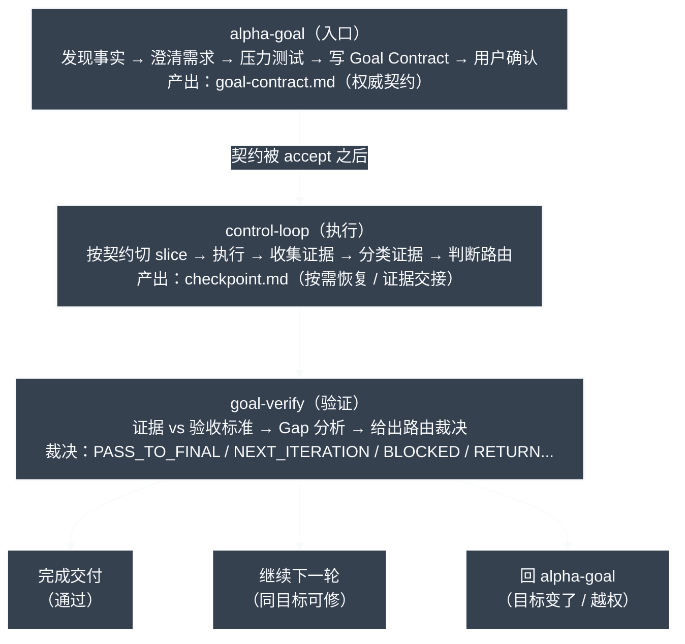

# Alpha Goal

语言：简体中文 | [English](README.en.md)

Alpha Goal 是用于 Goal Engineering 的最小持久闭环技能集。它要求智能体先发现事实再提问，基于已接受的 Goal Contract 和必要 checkpoint 恢复执行，在明确边界内行动，并且只在证据支持的范围内做最终声明。

## 解决什么问题

Alpha Goal 给 AI Agent 一套 Goal Engineering 控制闭环，重点约束三类常见失控：

| 问题 | 具体表现 | 控制方式 |
| --- | --- | --- |
| 目标漂移 | 需求没澄清就动手，做着做着方向偏了，顺手改一堆无关内容。 | `alpha-goal` 先发现事实、澄清目标、边界、非目标和验收证据，再写出用户确认的 `goal-contract.md`。 |
| 行动越界 | 没有授权边界，越过 scope、改错分支，或把当前实现当成期望行为。 | `control-loop` 只执行已接受契约内的有界 slice，变更前检查 worktree/branch、scope、non-goals 和 claim boundary。 |
| 完成无据 | 测试过了就说完成，或把局部成功当成目标达成。 | `goal-verify` 对照 acceptance evidence 做证据分类、Gap 分析和路由裁决。 |

本质上，它把需求澄清、授权边界、迭代执行、证据验证和验收声明，压缩成 Agent 能理解、执行、恢复的最小持久闭环。

## 核心架构



运行态写入 `${CODEX_HOME:-$HOME/.alpha-goal}/<workspace-slug>/`：`goal-contract.md` 是默认契约产物，`checkpoint.md` 是条件检查点，`control-state/latest.md` 只在任务身份不明时指向最新可恢复任务。

```text
Trigger -> Preflight/Discovery -> Clarify -> Write Contract -> Technical Design? -> Review -> Confirm
Accepted Goal Contract -> $control-loop -> Act -> Evidence -> $goal-verify -> Gap? -> Harden or Final Claim
```

## 快速开始

```bash
scripts/install.sh
npx --no-install tsx tools/validate_skills.ts .
```

安装脚本会在 `$HOME/.codex/skills/` 下为三个公开技能创建直接软链接，并清理指向本仓库旧公开技能的软链接。

## 使用示例

```text
$alpha-goal 判断这个任务下一步应发现事实、澄清、写契约、补技术方案、确认，还是交给闭环执行/验证。
$control-loop 根据已接受 Goal Contract 执行或加固下一轮最有用且可验证的有界 slice。
```

通常不需要显式写出 skill 名称。正常描述你的需求即可；当请求需要目标成帧、有界执行或有证据支撑的完成声明时，Alpha Goal 会隐式触发。

## 公开技能

| Skill | 作用 |
| --- | --- |
| [`alpha-goal`](skills/alpha-goal/) | 在开始工作前澄清意图、边界、验收证据，产出待确认 Goal Contract；跨文件预测性变更按需补 Technical Design。 |
| [`control-loop`](skills/control-loop/) | 执行或加固已授权 slice；`goal-contract.md` 是必需输入，`checkpoint.md` 仅作为条件检查点。 |
| [`goal-verify`](skills/goal-verify/) | 验证目标完成、声明边界、证据覆盖和重要但未声明的缺陷/风险（material unclaimed defects/risks），并输出下一轮 Gap。 |

## 设计原则

Alpha Goal 让 agent 工作保持目标明确、行动有界、声明受证据约束。

- 先发现，再澄清：提问前先检查本地事实、文档、状态和既有契约，让用户注意力只用于他们真正拥有的选择。
- 证据先于授权：当前代码事实只描述现状；期望行为来自用户意图、规格、issue 或已接受契约。
- 目标先于行动：结果（outcome）、范围（scope）、非目标（non-goals）、验收证据（acceptance evidence）、决策负责人（decision owner）和声明边界（claim boundary）共同限定什么可以被改变。
- 显式确认门：每个项目都要先写清 Goal Contract；契约或设计可以很短，但必须明确并获得用户确认，才能进入 `$control-loop`。
- 技术设计按需：当任务可能发生跨文件预测性操作时，Technical Design 需要覆盖架构、组件、数据流、接口、测试策略和风险。
- 只做有用建模：只有依赖、扰动和风险会影响安全控制、验证或路由时，才把它们纳入模型。
- 持久状态：`goal-contract.md` 是 `alpha-goal` 的默认产物，直接包含发现记录、访谈记录和最终契约；压缩恢复时优先读取草稿或已接受契约，accepted status 只限制执行交接；`checkpoint.md` 按需承载运行档案（run profile）、循环状态（loop state）、迭代、证据、验证，以及带证据、置信度、失效条件的记忆（memory）；`control-state/latest.md` 只在任务身份不明时指向最新可恢复任务。
- 有界执行：优先选择可取证的有界动作或定向变更，而不是宽泛重构和猜测式清理；已接受契约、必要 Run Profile 和仓库策略共同约束动作权限。
- 独立验证：最终、就绪、安全、完成、修复或评审等声明需要新鲜证据和缺陷/风险扫描（defect/risk sweep），并且要与执行过程分离检查。
- 诚实路由：目标不清回到 `alpha-goal`，同一目标内可修复的执行缺口回到 `control-loop`，证据或审查面不足的最终声明继续进入 `goal-verify`。
