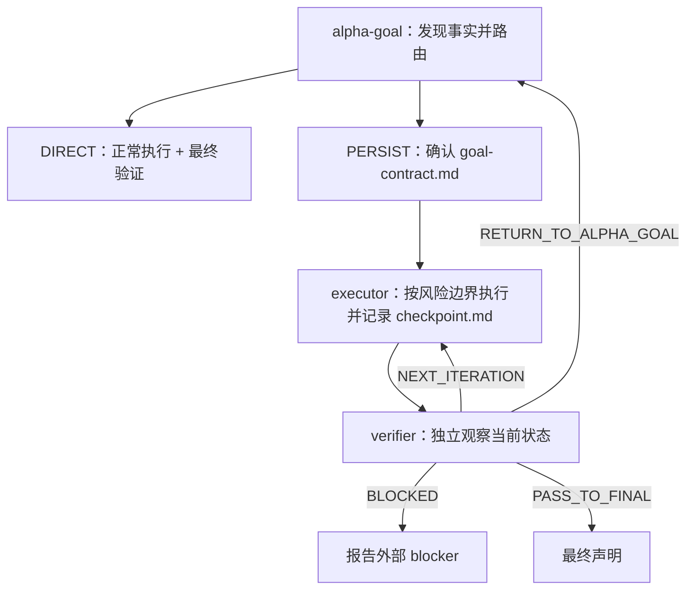

# Alpha Goal

语言：简体中文 | [English](README.en.md)

Alpha Goal 是一套按材料性风险路由的 Goal Engineering 技能。清晰、可逆、范围内的本地任务和纯只读任务直接执行；需要确认、恢复或可审计证据的复杂任务才进入持久闭环。

## 核心架构



`DIRECT` 不创建 Alpha Goal 状态，也不调用 `executor` 或 `verifier`。`PERSIST` 只保留两个运行时 artifact：

- `goal-contract.md`：由 `alpha-goal` 独占修改，记录权威、边界、成功标准和验收观察者。
- `checkpoint.md`：`executor` 写执行与原始执行证据，`verifier` 写独立验证观察、验收条目状态与 route；两者顺序交接。

路由只看材料性影响、副作用、恢复需求和可验证性；不以置信度、文件数、步骤数、问答轮次或预计时长替代风险判断。

## 公开技能

| Skill | 单一职责 |
| --- | --- |
| [`alpha-goal`](skills/alpha-goal/) | 发现事实，选择 `DIRECT / PERSIST`，并在持久路径建立和确认 Goal Contract。 |
| [`executor`](skills/executor/) | 仅执行已接受的持久契约，维护目标/交付 mutation、原始执行证据和恢复记录。 |
| [`verifier`](skills/verifier/) | 仅在风险边界或最终状态独立收集验证观察、更新验收条目状态并返回 route。 |

## 快速开始

```bash
bash ./scripts/install.sh
node tools/validate_skills.js .
node tools/validate_skills.js --fixtures
```

安装器把三个公开技能复制到所选运行时的独立目录，并同步相应用户模板。完整行为和 smoke 流程见 [INSTALL.md](INSTALL.md)。

通常不需要显式写 skill 名称，直接描述任务即可。需要手动触发时：

```text
$alpha-goal 根据已发现事实判断走 DIRECT 还是 PERSIST。
$executor 从已接受的 Goal Contract 恢复并执行下一批授权工作。
$verifier 对当前持久 checkpoint 做风险边界或最终状态验证。
```

## 设计原则

- 先发现事实，再处理由用户或其他授权来源拥有的材料性决策；现有代码不能自行定义期望行为。
- 直达任务不制造持久协议；持久任务用最小 artifact 支持授权、恢复和审计。
- 同一低风险边界内批量执行，只在材料性风险边界和最终状态调用 verifier。
- PASS 绑定实际观察到的最终目标与交付状态；后续 mutation 会使其失效。
- Native Goal、结构化提问和子代理均按当前表面能力条件化使用，不成为通用运行时前提。
